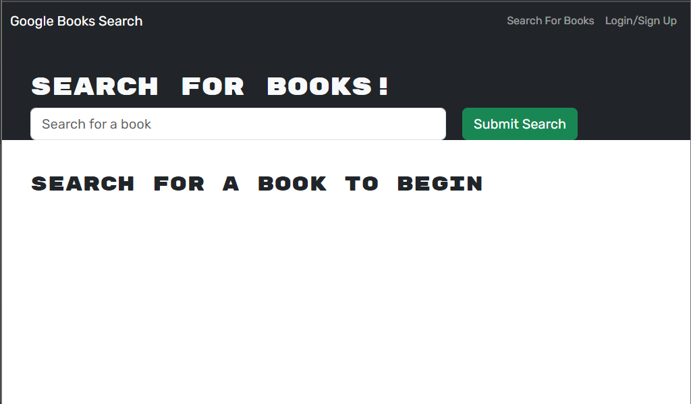
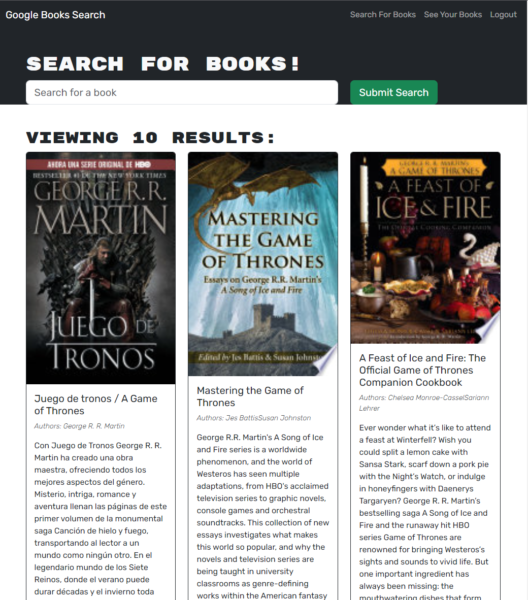

# Book Search Engine Starter Code<!-- omit in toc -->

<div align="center">
</img>
</img>
</div>

<div align="center"> <h2>Dependencies </h2> </div>

<div align="center"> 
    
    
    
</div>

## Table of contents <!-- omit in toc -->

- [Description](#description)
- [Usage](#usage)
- [Mock Up](#mock-up)
- [Credits](#credits)
- [License](#license)
- [Links](#links)

## Description
Book Search Engine is a web application that allows users to search for books and save them to their profile. The application uses React for the front-end, JWT for authentication, and GraphQL for querying the database. Users can create an account, search for books by title or author, and save books to their profile. The application also allows users to view their saved books and remove them from their profile.
## Usage
To use this project, follow these steps:

1. Clone the repository to your local machine.
2. Navigate to the root directory of the project in your terminal.
3. Run npm install to install the necessary dependencies.
4. Create a .env file in the root directory of the project and add your MongoDB connection string and JWT secret key as follows:
```
MONGODB_URI=<your MongoDB connection string>
JWT_SECRET=<your JWT secret key>
```
5. Run npm start to start the server and client.
6. Open your web browser and navigate to http://localhost:3000 to use the application.
> **Note:**  
> This project requires a MongoDB database and a JWT secret key to function properly. Please ensure that you have these set up before running the application.
## Mock Up
The following images demonstrate the functionality of the application.
<div align="center">
        <h2>Homepage</h2>
    </img>
        <h2>Book search</h2>
    </img>
        <h2>Save books</h2>
    </img>
</div>

## Credits
- Code by: [Daniel Sanchez](https://github.com/Morkendi)
- Starter code by: [Tec Bootcamps](https://github.com/coding-boot-camp/solid-broccoli)

## License

This project utilizes an MIT License. [Read more](https://choosealicense.com/licenses/mit/)

## Links
- Link to [GitHub repo](https://github.com/Morkendi/Book-Search-Engine)
- Link to [Deployment](https://agile-everglades-34943-d012e40475a2.herokuapp.com/)